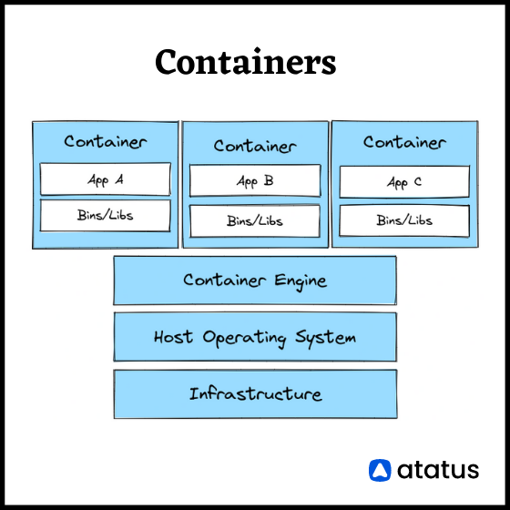

# Containers

    

---

# Linux Container

# Virtual Machine

É um software que simula um ambiente computacional, capaz de executar sistemas operacionais e aplicatiovs como se fosse uma máquina física.

Com a chegada da utilização de Virtual Machines o gerenciamento das aplicações se tornou mais fácil já por estarem centralizadas em uma uníca máquina através do gerenciador de VMs e também o gerenciamento da rede (localhost).

# Containers VS Virtual Machine

## VMs

Quando estamos utilizando um ambiente com VMs é necessário instalar no servidor um software de gerenciamento de VMs chamado **Hypervisor**

## Vantagens

- Ambiente Compartilhado
- Passivel de Centralização
- Rápida Restauração

## Desvantagens

- Um Sistema Operacional por VM
- Desperdício de Recursos
- Necessidade de hardware mais potente (Software de Gerenciamento de VMs)

## Containers

Containers são mais leves por compartilharem as bibliotecas e arquivos binários entre si, também não é necessário um OS para cada container, pois o **Container Engine** simula o OS nos containers, "enganando" o processo.

Em um servidor que utiliza containers, o software de gerenciamento é chamado de **Container Engine** atualmente o mais utilizado no mercado é o **Docker Engine**.

Os Containers também resolvem o problema "Na minha máquina funciona" pois a imagem do container que é utiliza durante o desenvolvimento local também é a mesma utiliza no servidor, com isso não há possibilidade de versões diferentes na execução do software.

## Vantagens

- Mais leve
- Sem custo de manutenção de Sistema Operacional
- Mais rápido para provisionar

## Desvantagens

