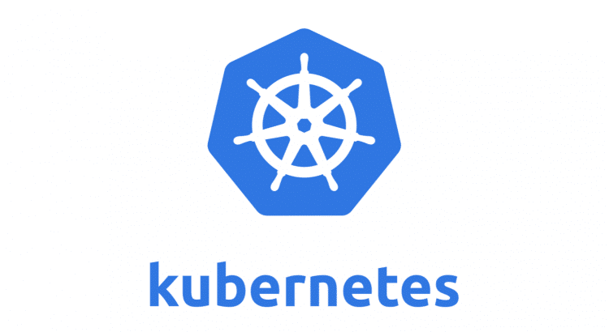
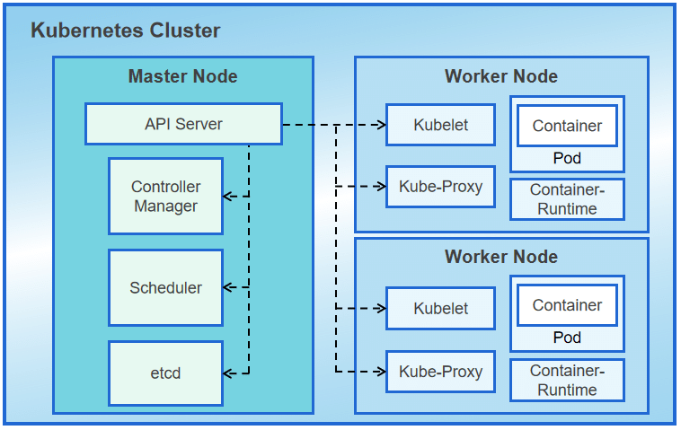

# Kubernetes

    

---

Criado pelo Google e hoje OpenSource é a ferramenta de orquestrão de container mais utilizada do mercado, apresenta mais complexidade de configuração do que os concorrentes, porém tem mais funcionalidades.

## Arquitetura Básica do K8S

- [Pod](./pod/README.md)

### Node

É uma máquina física ou virtual, onde o K8S está instalado

### Cluster

Conjuntos de Nodes agrupados

#### Master

Gerencia o Cluster e seus nodes, monitora para tomar alguma decisão.

    

