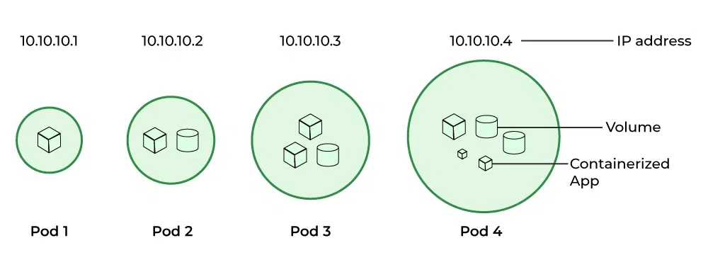

# Pod

    

---

É a menor unidade de computação publicável em um computador que podemos criar e gerenciar, o **K8S** não faz acesso direto aos containers e sim nos Pods isso ocorre devido o encapsulamento entre pod e *container*, um pod é uma instância unica de uma app.

A relação entre container e pod é de 1:1, é possível ter mais de um container dentro de um POD porém são raros os casos.